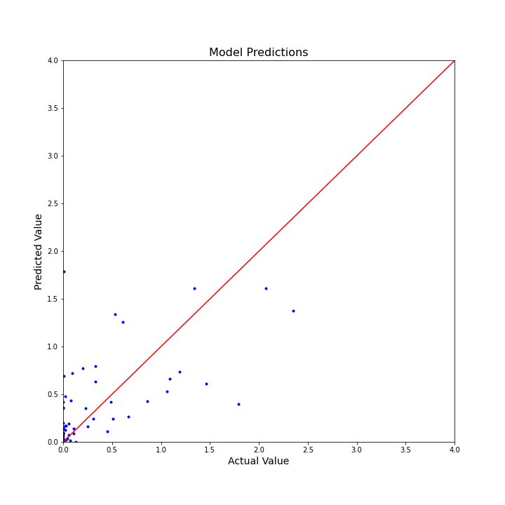
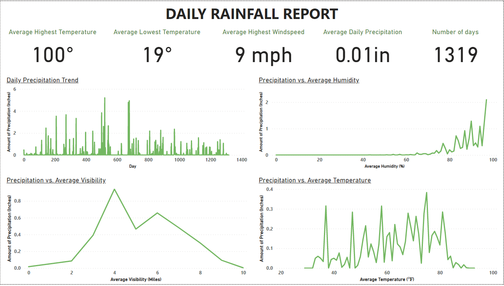

# Rainfall Prediction using Machine Learning

Rainfall Prediction is the application of meteorology and machine learning to predict the amount of rainfall over a region. It is important to exactly determine the rainfall for effective use of water resources, crop productivity and pre-planning of water structures.

Moreover, rainfall greatly affects human life in various sectors such as agriculture and transportation. Additionaly, it can cause natural disasters such as drought, floods, and landslides. The aim of this project is to build an accurate rainfall prediction model so that prescriptive measures can be made.

Governments, communities and individuals spend large amounts of money so that there is enough water available for everyone. Collecting and understanding rainfall data is important so that the right decisions are made.

Rainfall prediction has gained utmost research relevance in recent times due to its complexities and persistent applications such as flood forecasting and monitoring of pollutant concentration levels, among others. Existing models use complex statistical models that are often too costly, both computationally and budgetary, or are not applied to downstream applications. Therefore, approaches that use Machine Learning algorithms in conjunction with time-series data are being explored as an alternative to overcome these drawbacks.

The main objective of this project is to identify the relevant atmospheric features that cause rainfall and predict the intensity
of daily rainfall using various machine learning algorithms such as Multivariate Linear Regression (MLR), Multilayer Perceptron Regressor (Neural Network), KNeighbors Regressor, Ridge Regression, Random Forest Regressor, and Support Vector Regression (SVR).

In addition to, the Root Mean Squared Error (RMSE) and Mean Absolute Error (MAE) metrics were used to measure the performance of the machine learning models.

The dataset was collected from Kaggle. It contains meteorological data of Austin, Texas. Further, Austin has a humid subtropical climate, which means it has long, hot summers and typically mild winters. In July and August, high temps often top out at around 100 degrees Fahrenheit (38 degrees Celsius), sometimes for several days in a row. The humidity is usually only at sauna-like levels just before a rainstorm, but even when it’s not raining, the humidity rarely dips below 30 percent.

Therefore, atmospheric features such as temperature, relative humidity, sea level pressure, and wind speed are seen as important features that predict rainfall accurately.


## Acknowledgements

 - [What Is a Regression Model?](https://www.imsl.com/blog/what-is-regression-model#:~:text=A%20regression%20model%20provides%20a,by%20a%20linear%20regression%20model.)
 - [Approaching (Almost) Any Machine Learning Problem Paperback](https://www.amazon.com/Approaching-Almost-Machine-Learning-Problem/dp/8269211508)
 - [Austin Weather](https://www.kaggle.com/datasets/grubenm/austin-weather)


## Appendix


Linear regression is a basic predictive analytics technique that uses historical data to predict an output variable. It is popular for predictive modelling because it is easily understood and can be explained using plain English.

Linear regression models have many real-world applications in an array of industries such as economics (e.g. predicting growth), business (e.g. predicting product sales, employee performance), social science (e.g. predicting political leanings from gender or race), healthcare (e.g. predicting blood pressure levels from weight, disease onset from biological factors), and more.

Understanding how to implement linear regression models can unearth stories in data to solve important problems.

## Authors

- [@MichaelTobiko](https://github.com/miketobz)


## API Reference

#### LinearRegression()

```http
 from sklearn import linear_model
```
LinearRegression fits a linear model with coefficients w = (w_1, ..., w_p) to minimize the residual sum of squares between the observed targets in the dataset, and the targets predicted by the linear approximation. Mathematically it solves a problem of the form:

min_{w} || X w - y||_2^2

#### Class MLPRegressor

```http
  from sklearn.neural_network import MLPRegressor
```
In regression, the output remains as f(x); therefore, output activation function is just the identity function. MLP uses different loss functions depending on the problem type. The loss function for classification is Average Cross-Entropy, which in binary case is given as,

Loss(\hat{y},y,W) = -\dfrac{1}{n}\sum_{i=0}^n(y_i \ln {\hat{y_i}} + (1-y_i) \ln{(1-\hat{y_i})}) + \dfrac{\alpha}{2n} ||W||_2^2

where 'alpha ||W||_2^2' is an L2-regularization term (aka penalty) that penalizes complex models; and 'alpha > 0' is a non-negative hyperparameter that controls the magnitude of the penalty.

#### RandomForestRegressor
```http
  from sklearn.ensemble import RandomForestRegressor
```
You can play with these parameters to see how the results change.

n_estimators: int, default=100
The number of trees in the forest.

criterion: {“squared_error”, “absolute_error”, “friedman_mse”, “poisson”}, default=”squared_error”
The function to measure the quality of a split. Supported criteria are “squared_error” for the mean squared error, which is equal to variance reduction as feature selection criterion and minimizes the L2 loss using the mean of each terminal node, “friedman_mse”, which uses mean squared error with Friedman’s improvement score for potential splits, “absolute_error” for the mean absolute error, which minimizes the L1 loss using the median of each terminal node, and “poisson” which uses reduction in Poisson deviance to find splits. Training using “absolute_error” is significantly slower than when using “squared_error”.

New in version 0.18: Mean Absolute Error (MAE) criterion.

New in version 1.0: Poisson criterion.

max_depth: int, default=None
The maximum depth of the tree. If None, then nodes are expanded until all leaves are pure or until all leaves contain less than min_samples_split samples.

min_samples_split: int or float, default=2
The minimum number of samples required to split an internal node:

If int, then consider min_samples_split as the minimum number.

If float, then min_samples_split is a fraction and ceil(min_samples_split * n_samples) are the minimum number of samples for each split.

## 🔗 Links
[](https://www.linkedin.com/in/michael-tobiko-1563a693)
[](twitter.com/MichaelTobiko)


## Demo





## Installation

Install my-project with npm

```bash
  npm install my-project
  cd my-project
```
    
## Deployment

To deploy this project run

```bash
  npm run deploy
```


## Data Visualization




## Lessons Learned
With high-dimensional datasets (meaning datasets with a large number of features), linear models become more powerful, and there is a higher chance of overfitting.

In terms of model performance, the Random Forest Regressor model out-performed all other machine learning models. However, the Support Vector Regression came close. The Multilayer Perceptron Regressor's performance was the worst; it displayed a high Root Mean Squared Error value, as compared to the other models.

All things considered, the machine learning models did not perform as expected due to an imbalanced dataset; the target (dependent variable) is highly skewed with zero (0) values.
